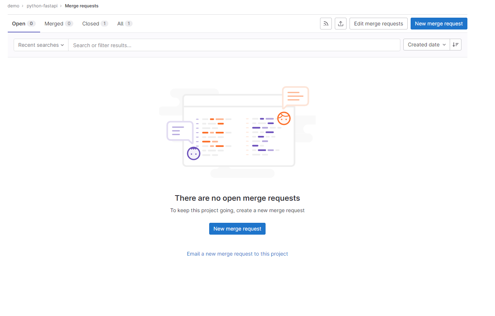
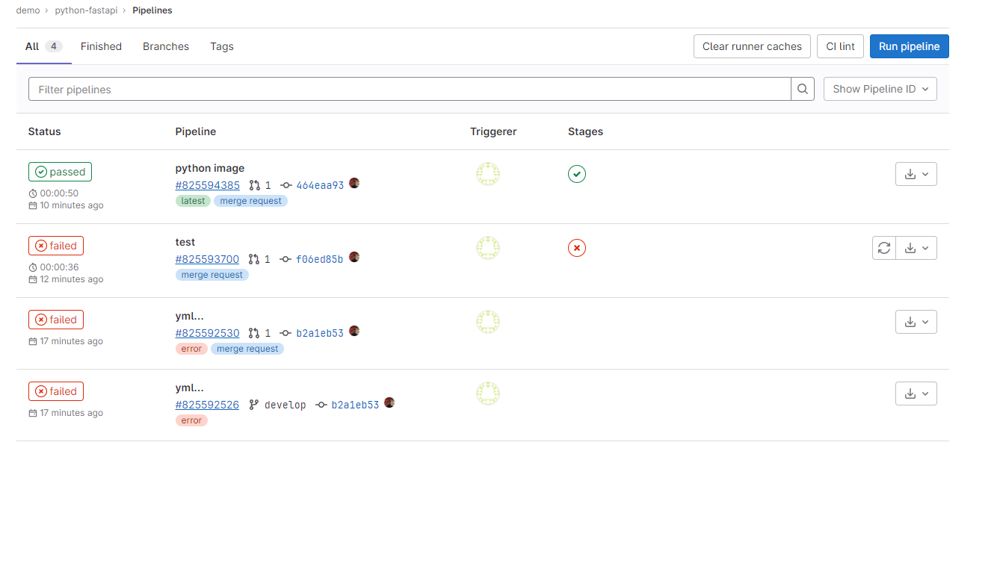

## Configurar Gitlab CI 

Lo que haremos ahora es configurar un pipeline que se ejecute cada vez que se cree un merge request.
Un merge request es una solicitud de mezcla de código, es decir, cuando se quiere integrar un código a la branch principal.

Para esto, debemos crear un archivo llamado `.gitlab-ci.yml` en la raíz del proyecto.

```yaml
stages:
  - test

test:
  stage: test
  image: python:3.9
  script:
    - pip install -r requirements.txt
    - pytest test/test.py
  only:
    - merge_requests
```

Al ser esto un proyecto de python, usaremos la imagen de python 3.9 para ejecutar el pipeline. Además solo
se ejecutará cuando se cree un merge request.

Como puedes ver el script es muy simple, solo instala las dependencias y ejecuta las pruebas.

## Crear merge request

Si estas en tu branch principal
  
```shell
git checkout -b develop
git add .
git commit -m "add gitlab ci"
git push origin develop
```

Nos iremos a nuestra cuenta de gitlab y crearemos un merge request haciendo click en el botón **New merge request**.


Seleccionamos la branch de origen y la branch de destino y hacemos click en el botón **Compare branches and continue**.


Le damos un nombre al merge request, una descripción y hacemos click en el botón **Submit merge request**.


## Ejecutar pipeline
Creado el merge request, nos iremos a la pestaña **Pipelines** y veremos que el pipeline se está ejecutando.
