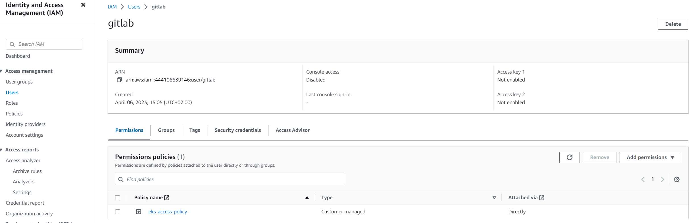
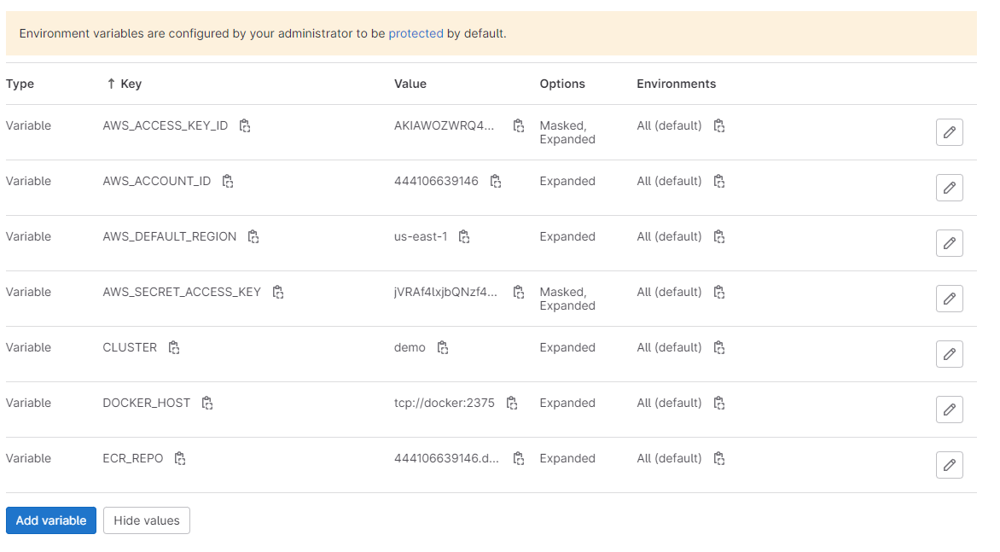
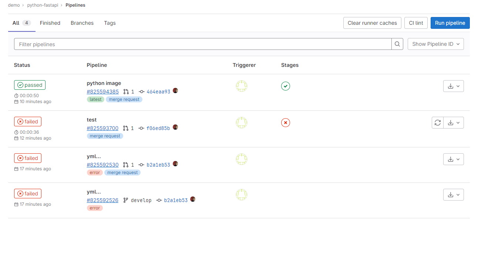

## Gitlab CI/CD Deployment

En esta clase lo que haremos es crear un pipeline de CI/CD para nuestro proyecto. Para ello vamos a utilizar Gitlab CI/CD. Pero antes necesitamos un cluster a donde desplegar. 

Aunque el proyecto final va a ser en el frontend, como equipo DevOps es importante conocer esta herramienta porque es muy utilizada en la industria.

### Crear cluster en AWS

```shell
eksctl create cluster --name demo --version 1.25 --region us-east-1 --nodegroup-name workers --node-type t3.small --nodes 1 --nodes-min 1 --nodes-max 2 --managed
```

Recuerden que este comando nos creara el cluster y la vpc para que corran nuestros nodos.

### Crear usuario de Gitlab en AWS

Vamos a la consola de AWS y creamos un usuario de IAM con el nombre de gitlab. También vamos a necesitar generar una politica que le permita descubrir el cluster, esto será necesario para que el usuario de gitlab pueda interactuar con el cluster durante el proceso de deployment.



### iam policy

```json
{
    "Version": "2012-10-17",
    "Statement": [
        {
            "Sid": "VisualEditor0",
            "Effect": "Allow",
            "Action": [
                "eks:DescribeCluster",
                "eks:ListClusters"
            ],
            "Resource": "*"
        }
    ]
}
```

Tambien vamos a necesitar agregarle la politica de AmazonEC2ContainerRegistryPowerUser a nuestro usuario.

### Generar credenciales

Necesitamos generar las credenciales que luego usaremos en el pipeline de CI/CD. Para ello vamos a la consola de AWS y vamos a la sección de IAM. En la sección de usuarios vamos a seleccionar el usuario que creamos anteriormente y vamos a la sección de credenciales de seguridad. Ahí vamos a generar las credenciales de acceso.


## Crear archivos kubernetes para desplegar

Vamos a crear los archivos kubernetes que vamos a utilizar para desplegar nuestra aplicación. 

nota: los archivos estan en el directorio k8s/fastapi.yaml

lo vamos añadir al proyecto y vamos hacer commit y push a nuestro repositorio.

### RBAC en AWS

Una vez que nuestro cluster este listo. Vamos agregar unos permisos que permitan a gitlab interactuar con el cluster. Para ello vamos a crear un archivo yaml que nos permita crear un role y un rolebinding que nos permita interactuar con el cluster.

```yaml
---
kind: Role
apiVersion: rbac.authorization.k8s.io/v1
metadata:
  name: gitlab-role
  namespace: web
rules:
- apiGroups: [""]
  resources: ["pods", "services"]
  verbs: ["get", "list", "watch", "create", "update", "delete"]
---
kind: RoleBinding
apiVersion: rbac.authorization.k8s.io/v1
metadata:
  name: gitlab-binding
  namespace: web
subjects:
- kind: User
  name: gitlab-deployer
  apiGroup: rbac.authorization.k8s.io
roleRef:
  kind: Role
  name: gitlab-role
  apiGroup: rbac.authorization.k8s.io
```

Referencia: https://kubernetes.io/docs/reference/access-authn-authz/rbac/

antes de desplegarlo vamos a crear el namespace web

```shell
kubectl create namespace web
```

y ahora si vamos a desplegarlo

```shell
kubectl apply -f rbac.yaml
```

El usuarios gitlab solo tendrá acceso a los recursos que se encuentren en el namespace web. Recuerda que no solo debes considerar la seguridad de tu entorno aws sino el de cluster. Un acceso no autorizado podria acceder a credenciales para elevar privilegios o simplemente dañar el cluster e interrumpir el servicio.

### Asociar usuario de gitlab a cluster
eksctl create iamidentitymapping --cluster demo --arn arn:aws:iam::444106639146:user/gitlab --username gitlab-deployer --group system:authenticated

podemos verificar que el usuario se haya creado correctamente con el siguiente comando

```shell
kubectl get configmap -n kube-system aws-auth -o yaml
```

### Crear pipeline de CI/CD

En la raíz del proyecto creamos el archivo .gitlab-ci.yml

```yaml
stages:
  - ci
  - build
  - deploy

ci:
  stage: ci
  image: python:3.9
  script:
    - pip install -r requirements.txt
    - pytest test/test.py
  only:
    - merge_requests

build:
  stage: build
  image: 
    name: amazon/aws-cli
    entrypoint: [""]
  services:
    - docker:dind
  before_script:
    - amazon-linux-extras install docker -y
  script:
    - aws ecr get-login-password --region $AWS_DEFAULT_REGION | docker login --username AWS --password-stdin $AWS_ACCOUNT_ID.dkr.ecr.$AWS_DEFAULT_REGION.amazonaws.com
    - docker build -t $ECR_REPO:$CI_COMMIT_SHORT_SHA .
    - docker push $ECR_REPO:$CI_COMMIT_SHORT_SHA
  only:
    - master
  needs:
    - job: ci

deploy:
  stage: deploy
  image:
    name: amazon/aws-cli
    entrypoint: [""]
  before_script:
    - curl -LO "https://dl.k8s.io/release/$(curl -L -s https://dl.k8s.io/release/stable.txt)/bin/linux/amd64/kubectl"
    - chmod +x ./kubectl
    - mv ./kubectl /usr/local/bin/kubectl
  script:
    - aws eks update-kubeconfig --name $CLUSTER --region $AWS_DEFAULT_REGION
    - kubectl set image deployment/fastapi api=$ECR_REPO:$CI_COMMIT_SHORT_SHA --namespace web
  only:
    - master
  needs:
    - job: build

```

### Variables de entorno

Tenemos que agregar las variables de entorno en el proyecto de gitlab. Para ello vamos a la sección de settings y luego a la sección de CI/CD. En la sección de variables vamos a agregar las siguientes variables.



### Ejecutar pipeline

Primero vamos hacer commit y creamos un merge request. Una vez aprobado el merge a nuestro branch principal entonces nuestro pipeline deberia ejecutarse.



podremos comprobar que nuestra imagen se ha actualizado exitosamente en nuestro cluster. Haciendo un describe al pod para ver que imagen esta corriendo.
  
```shell
kubectl describe pod fastapi-7f7f7f7f7f-7f7f7f7f7f -n web
```


