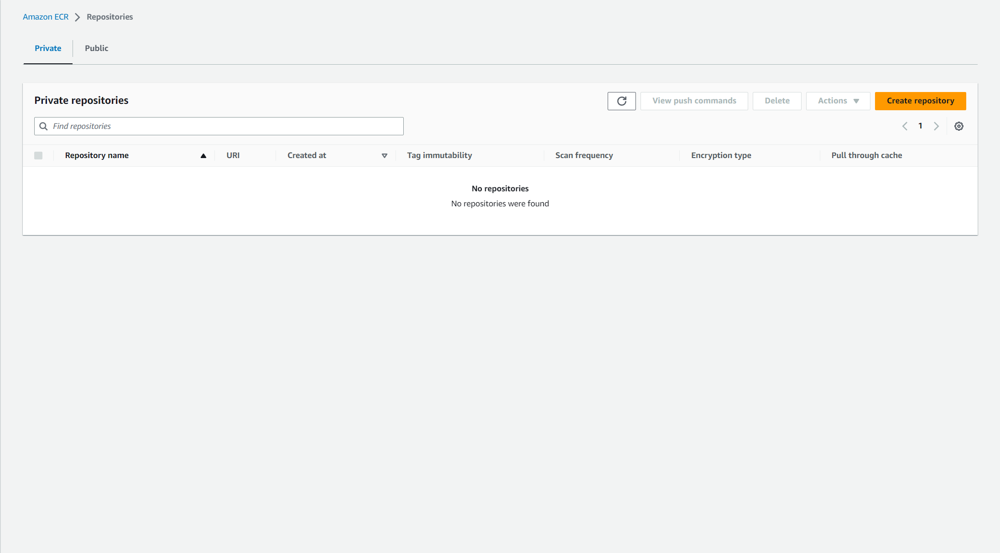
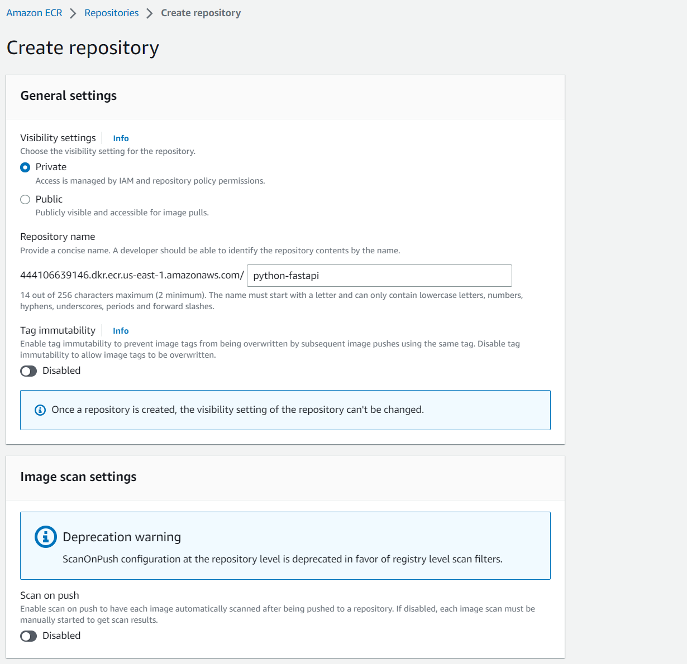

## Pasos para configurar repositorio de contenedores en AWS ECR

### Paso 1: Crear un repositorio de contenedores
Nos movemos al servicio de ECR y hacemos click en el botón **Create repository**.


### Paso 2: Configurar el repositorio de contenedores

Le colocamos un nombre y le decimos crear el repositorio.


### Paso 3: Configurar el acceso al repositorio de contenedores

Una vez create el repositorio, nos vamos a la pestaña **Permissions** y hacemos click en el botón **Edit policy json** y pega la siguiente politica.

```shell
{
  "Version": "2012-10-17",
  "Statement": [
      {
          "Sid": "AllowPushPull",
          "Effect": "Allow",
          "Principal": {
              "AWS": [
                "arn:aws:iam::444106639146:user/dave"
              ]
          },
          "Action": [
              "ecr:BatchGetImage",
              "ecr:BatchCheckLayerAvailability",
              "ecr:CompleteLayerUpload",
              "ecr:GetDownloadUrlForLayer",
              "ecr:InitiateLayerUpload",
              "ecr:PutImage",
              "ecr:UploadLayerPart"
          ]
      }
  ]
}
```

hay que cambiar el numero de cuenta por el numero de cuenta de tu cuenta de AWS y el nombre de usuario.

## Paso 4: Autenticar Docker con ECR
En la terminal ejecutamos el siguiente comando

```shell
aws ecr get-login-password --region us-east-1 | docker login --username AWS --password-stdin 444106639146.dkr.ecr.us-east-1.amazonaws.com
```

## Paso 5: Crear imagen de Docker

```shell
docker build -t python-fastapi .
```

## Paso 6: Etiquetar imagen de Docker

```shell
docker tag python-fastapi:latest 444106639146.dkr.ecr.us-east-1.amazonaws.com/python-fastapi:latest
```

## Paso 7: Subir imagen de Docker a ECR

```shell
docker push 444106639146.dkr.ecr.us-east-1.amazonaws.com/python-fastapi:latest
```
